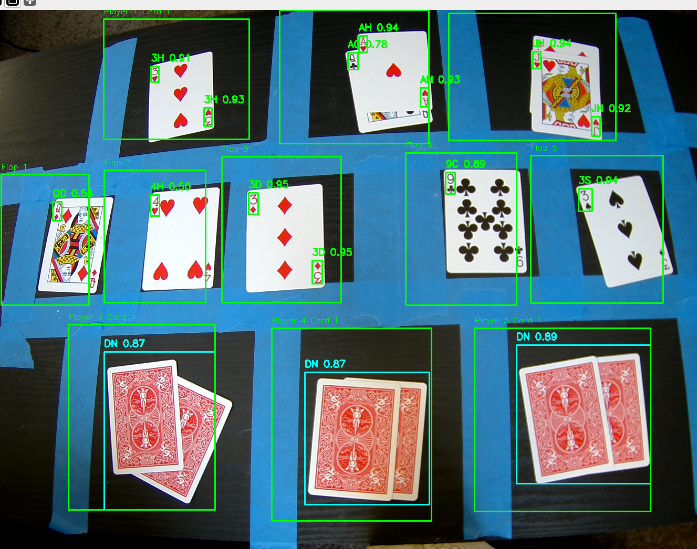

# Playing-Cards-Detection-with-YoloV8


### Steps to run Code

- Clone the repository
```
git clone https://github.com/noorkhokhar99/Playing-Cards-Detection-with-YoloV8.git
```

- Goto cloned folder
```
cd Playing-Cards-Detection-with-YoloV8
```

- Install the ultralytics package
```
pip install ultralytics==8.0.0
```

- Start tracking 
```

python flop.py
options:
  -h, --help      show this help message and exit
  -v, --verbose   Enable verbose output
  -z, --setzones  Sets zones

set zones for first run.

```
- website

```
python -m http.server 8080
navigate to [localhost:8080](localhost:8080)

```


### Results

## Live GUI

<p align="center">
  
</p>

## Live computer vision 

<p align="center">
  
</p>

