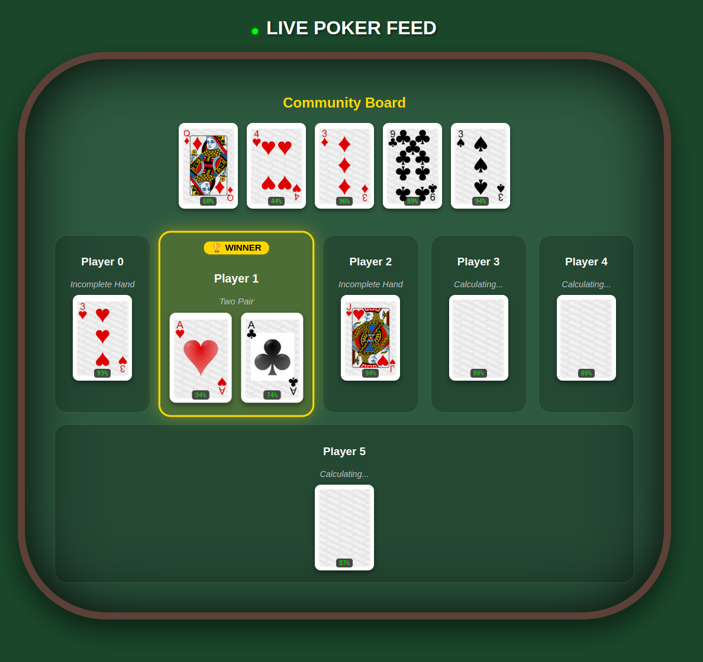
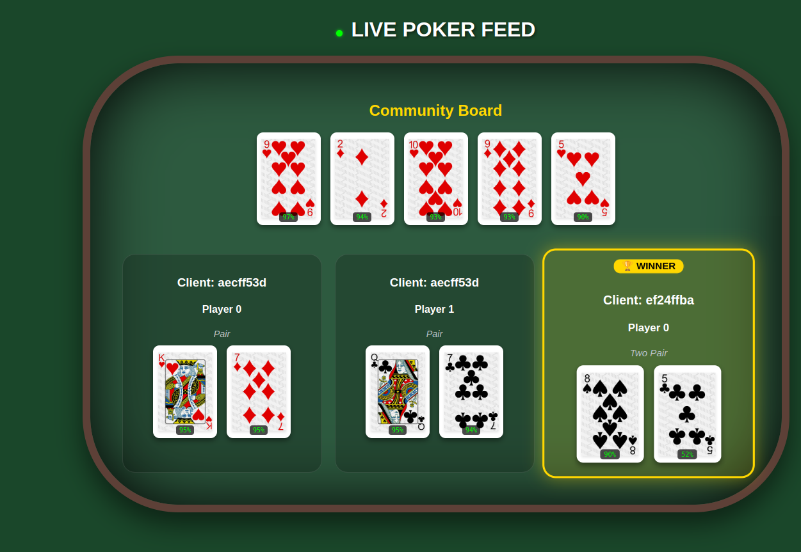
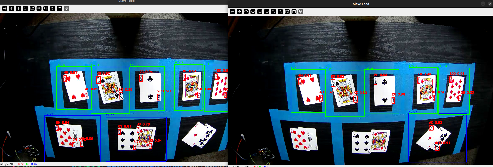
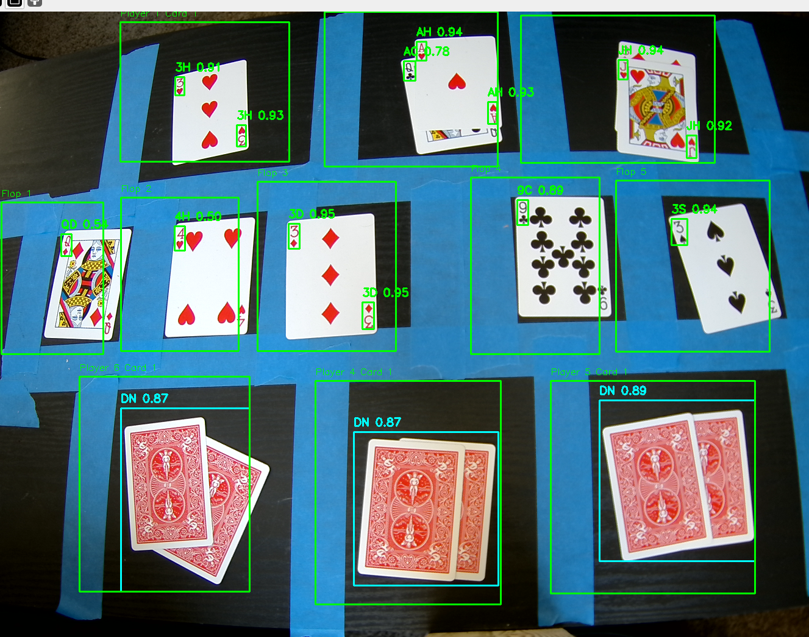

# Poker Tracker


### Steps 

- requirements
```
pip install ultralytics==8.0.0
```

- Start tracking 
```

python flop.py
options:
  -h, --help      show this help message and exit
  -v, --verbose   Enable verbose output
  -z, --setzones  Sets zones

set zones for first run.

```
- website

```
python -m http.server 8080
navigate to localhost:8080

```

## test multiple clients

```
ython3 PokerTracker/client.py --video Testvideo.mp4 -pz p_slots_play12 & python3 PokerTracker/client.py --video Testvideo.mp4 -pz p_slots_play3 &

```


### Results

## Live GUI

<p align="center">
  
</p>

## multiple clients
<p align="center">
  
</p>

<p align="center">
  
</p>

## Live computer vision 

<p align="center">
  
</p>

