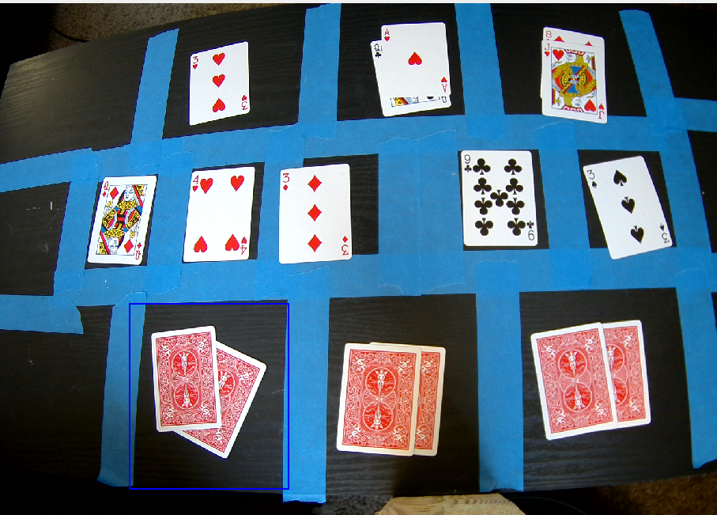

# Set up detection zones
```
python flop.py -z
```
```
Do you want to draw boxs? (yes/no): y

```

## Add player zones
#### Draw boxes around each player slot. 
- Press [SPACE] to confirm zone.
- Press [SPACE] to add another player
- Press [ENTER] to confirm all player spots

<p align="center">
  
</p>

```
Select a ROI and then press SPACE or ENTER button!
Cancel the selection process by pressing c button!
Added player at (446, 609, 317, 382). Press Space for more or Enter to finish.
Select a ROI and then press SPACE or ENTER button!
Cancel the selection process by pressing c button!
Added player at (864, 607, 312, 386). Press Space for more or Enter to finish.
Select a ROI and then press SPACE or ENTER button!
Cancel the selection process by pressing c button!
Added player at (1248, 593, 369, 362). Press Space for more or Enter to finish.
Select a ROI and then press SPACE or ENTER button!
Cancel the selection process by pressing c button!
Added player at (519, 24, 293, 242). Press Space for more or Enter to finish.
Select a ROI and then press SPACE or ENTER button!
Cancel the selection process by pressing c button!
Added player at (872, 0, 297, 251). Press Space for more or Enter to finish.
Select a ROI and then press SPACE or ENTER button!
Cancel the selection process by pressing c button!
Added player at (1214, 0, 302, 235). Press Space for more or Enter to finish.
```
## Add flop spots
#### Draw boxes around each flop card
- Press [SPACE] to confirm zone.
  
```
Selection complete.
Draw Flop Slot 1 and press ENTER
Select a ROI and then press SPACE or ENTER button!
Cancel the selection process by pressing c button!
Draw Flop Slot 2 and press ENTER
Select a ROI and then press SPACE or ENTER button!
Cancel the selection process by pressing c button!
Draw Flop Slot 3 and press ENTER
Select a ROI and then press SPACE or ENTER button!
Cancel the selection process by pressing c button!
Draw Flop Slot 4 and press ENTER
Select a ROI and then press SPACE or ENTER button!
Cancel the selection process by pressing c button!
Draw Flop Slot 5 and press ENTER
Select a ROI and then press SPACE or ENTER button!
Cancel the selection process by pressing c button!
```

## View Zones
<p align="center">
  
</p>
